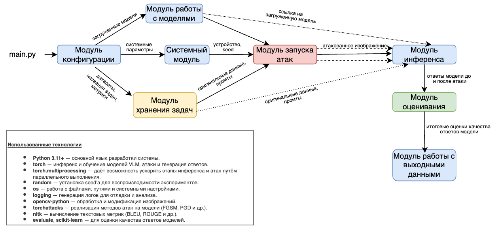

# VLM Robustness Evaluator

**VLM Robustness Evaluator** — модульный программный комплекс для оценки робастности VLMs к состязательным атакам.
Система поддерживает:
- визуальные задачи: VQA, Image Captioning, RefCOCO, ScienceQA
- типы атак: targeted, untargeted, patch-based
- методы оптимизации: PGD, APGD, CW
- типы метрик: классификационные, генерационные, семантические и локализационные

---

## Архитектура



---

## Используемые технологии

- **Python 3.11+** — основной язык
- **torch** — инференс и обучение VLM
- **torch.multiprocessing** — параллельное выполнение атак
- **os, pathlib** — работа с файловой системой
- **logging** — отслеживание выполнения
- **opencv-python** — обработка изображений
- **torchattacks** — атаки PGD, FGSM, CW
- **nltk, bert-score, evaluate** — текстовые и классификационные метрики

---

## Поддерживаемые задачи

| Название задачи                     | Датасет    | Тип            | Метрики                                       |
|-------------------------------------|------------|----------------|-----------------------------------------------|
| Visual Question Answering (VQA)     | VQAv2      | Classification | accuracy, asr, levenshtein, clipscore         |
| Image Captioning                    | MS COCO    | Generation     | cider, bertscore, clipscore, levenshtein      |
| Referring Expression Comprehension  | RefCOCO    | Localization   | iou, clipscore                                |
| Visual Commonsense Reasoning        | ScienceQA  | Classification | accuracy, asr, levenshtein, clipscore         |

---

## Поддерживаемые модели

| Модель          | Источник Hugging Face           |
|-----------------|---------------------------------|
| LLaVA-1.5       | `liuhaotian/llava-v1.5-7b`      |
| MiniGPT-4       | `Vision-CAIR/MiniGPT-4`         |
| InternVL2-3B    | `OpenGVLab/InternVL-Chat-V1-3B` |
| Deepsek-vl      | `deepsek/deepset-vl-1.3b-base`  |
| Pixtral-3B-2409 | `pixtral/Pixtral-3B-2409`       |
| OmniFusion      | `internlm/OmniFusion`           |
| Fuyu-8B         | `adept/fuyu-8b`                 |

---

## Структура проекта

```
├── attacks/               # Реализация атак 
├── configs/               # YAML-конфигурации моделей, задач, атак, оптимизаторов
├── controller/            # Основной управляющий модуль: инференс, атака, метрики
├── data/                  # Загрузчики датасетов, автоматическое скачивание и парсинг
│   └── datasets/          # Конкретные датасеты: VQA, MSCOCO, RefCOCO, ScienceQA
├── docs/                  # Архитектура
├── hub/                   # Загрузка и обёртки моделей HuggingFace
│   └── models/            # Конкретные работа с моделями
├── metrics/               # Модули расчёта классификационных, генеративных и семантических метрик
├── optimizers/            # Реализации PGD, APGD, CW для атак
├── outputs/               # Предсказания, метрики, логиты, атакованные изображения
├── utils/                 # Утилиты 
├── main.py                # Точка входа для запуска всего пайплайна
├── Dockerfile             # Контейнер Docker
├── requirements.txt       # Python-зависимости проекта
└── README.md              # Документация по проекту

```

---

## Пример конфигурации

```yaml
models:
  - name: llava
    type: llava
    path: liuhaotian/llava-v1.5-7b
    device: cuda:0

tasks:
  - name: vqa
    dataset: vqav2
    metrics: [accuracy, asr]
    max_samples: 200
    
``` 

## Запуск

### Через Python

```bash
pip install -r requirements.txt

python main.py \
  --config configs/config.yaml \
  --output_dir results/exp1 \
  --log_level info
```

### Через Docker

```bash
docker build -t vlm-evaluator .

docker run --gpus all --rm \
  -v $(pwd):/app \
  vlm-evaluator \
  --config configs/config.yaml \
  --output_dir /app/outputs/run1

```

После запуска все результаты сохраняются в директорию `outputs/`:
- `.csv` и `.json` файлы с предсказаниями
- атакованные изображения
- оценки метрик до и после атак

### CLI-параметры запуска

| Аргумент           | Описание                                                              |
|--------------------|-----------------------------------------------------------------------|
| `--config`         | Путь к YAML-файлу конфигурации *(обязательный)*                       |
| `--output_dir`     | Папка для сохранения результатов                                      |
| `--log_level`      | Уровень логирования: `debug`, `info`, `warning` (по умолчанию `info`) |
| `--attack_only`    | Запустить только этап генерации атакованных примеров                  |
| `--inference_only` | Запустить только инференс моделей                                     |
| `--eval_only`      | Запустить только подсчёт метрик                                       |


## Вывод результатов

Все результаты метрик, изображения и метрики сохраняются в директорию, указанную в `output` (по умолчанию `outputs/benchmark_run/`).

Возможности вывода:

| Объект         | Формат          | Описание                                |
|----------------|-----------------|-----------------------------------------|
| Предсказания   | `.json`         | Ответы моделей до и после атаки         |
| Метрики        | `.csv`, `.json` | Качество модели по каждой метрике       |
| Изображения    | `.png`, `.jpg`  | Атакованные версии входных изображений  |
| Конфигурация   | `.yaml`         | Снэпшот использованного `config.yaml`   |

Примеры файлов:
```
outputs/
├── benchmark_run/
│   ├── vqa_clean_predictions.json
│   ├── vqa_adv_predictions.json
│   ├── vqa_metrics.csv
│   ├── config_used.yaml
│   └── images/
```
Вывод контролируется через параметры:
```yaml
output:
  save_predictions: true
  save_metrics: true
  save_images: true
  export_format: [csv, json]
```